# 人工智能实验报告 第9周

姓名:刘卓逸  学号:21307303

## 一.实验题目

hw7 机器学习：图像分类任务

## 二.实验内容

### 1.实验要求

在MNIST数据集上完成手写数字图片分类任务, 具体要求如下:

+ 示例代码中已经给出从.pth文件加载数据集的代码( Tensor类型), 命名为(train_data, train_labels), (test_data, test_labels), 分别是训练图像, 训练标签, 测试图像和测试标签. 请基于这些Tensor完成训练任务以及测试任务.
+ 用pytorch搭建卷积神经网络(在类中MyConvNet来实现), 在训练集上训练模型, 并在测试集上完成分类测试.
+ 为了方便批改作业, MyConvNet的构造函数请不要使用任何形参.测试时至少用分类正确率来衡量性能(可以添加其他指标来衡量性能并在报告中呈现).
+ 训练结束后, 务必使用torch.save()保存模型(即神经网络的参数等信息). 此次作业需要额外上传模型.模型的文件名格式为hw7_学号_姓名拼音.pth, 例如hw7_21000000_zhangsan.pth.
+ 所有内容在同一个.py代码文件上实现.
+ 作业提交时将.py代码文件和.pth模型文件提交到本科生实验hw7_code文件夹中, 实验报告提交到本科生实验hw7_report文件夹中. 请不要提交其他无关文件.

### 2.算法原理

#### （1）整体框架

```
定义好超参数
创建模型并初始化
将训练数据集拆分成训练集与验证集两部分
对于每个epoch:
    用训练集进行训练：
        将数据输入模型得到预测结果
        计算预测结果与label之间的损失函数
        用反向传播计算梯度
        更新模型参数
    再用验证集求模型准确率:
        将数据输入模型得到预测结果
        计算平均损失函数与准确率
    保存较之前准确率有提升的模型
训练完成，用测试集测量模型实际准确率
```

#### （2）具体实现

##### 1-神经网络架构

针对图像识分类问题，采用卷积神经网络。

全连接层的参数数量过多，卷积神经网络便是通过只监测部分子区域、所有子区域公用一套参数来实现减少参数规模的效果

从另一个角度看，不同卷积核代表了图像的不同特征，卷积核扫过整个图形可以提取出对应特征出现的位置。

如当卷积核为

$$
\begin{bmatrix}
-1 & 0 & 1 \\
-1 & 0 & 1 \\
-1 & 0 & 1
\end{bmatrix}
$$

卷积层输出在左0右1的竖直边缘为正，在左1右0的竖直边缘为负，在连续色块内部以及水平边缘就为0

通过训练多个卷积核，以得到更好的特征提取效果

##### 2-损失函数

CrossEntropy,具体为 $H(P,Q)=-\sum_{x}P(x)\log Q(x)$ , $P(x)$为实际分布，$Q(x)$为预测分布

平方误差(Mean Squre Error),具体为 $MSE=\frac{1}{n}\sum_{i=1}^{n}(y_i-\hat{y_i})^2$

在01二分类问题中,经过sigmoid函数后，若采用平方误差，在$f(x)=0$与$f(x)=1$时都会有梯度趋于0，导致离minimal很远很远的地方的梯度很小，训练效果就会不好。故**选择CrossEntropy作为损失函数**

##### 3-优化算法

**Adam** = RMSProp + Momentum

模型参数$θ_{i}$迭代方式为 $θ^{t+1}_{i} ← θ^{t}_{i} - m^{t}_{i}*{η}/{σ^{t}_{i}}$

其中 $σ^{t}_{i}= \sqrt{α(σ^{t-1}_{i})^{2}+(1-α)|g^{t}_{i}|^{2}}$  ,  $m^{t}_{i}=βm^{t-1}_{i}+(1-β)g^{t}_{i}$

RMSProp部分：${η}/{σ^{t}_{i}}$ , 思想是自适应动态学习率，使学习率保持动态稳定

Momentum部分：$m^{t}_{i}$ ，有“惯性”思想，通过保留上一次的部分梯度，使得能有效避免局部最低点或平衡点。$g^{t}_{i}$是当前的梯度，$β$可以看做为“动量保留率”，$βm^{t-1}_{i}$就是保留的动量

还有随机梯度下降SGD与Momentum结合的**SGDM** 、Adam的一个改进**NAdam**也会在实验中测试

##### 4-学习率计划

在训练开始时我们希望学习率大一点快速收敛，在接近收敛的地方我们希望学习率小一点微调参数，于是就有了schduler

实验中将会测试**恒定学习率**、**StepLR**、**WarmUP**,三种scheduler

**StepLR**就是每隔若干个epoch令学习率乘上一个常数，即令学习率呈指数下降

**WarmUP**是让学习率线性提升到最大值，然后以指数或三角函数等方式下降

### 3.代码展示

#### 准备环境

```python
#------ import env ------
import torch
import torch.nn as nn
import torch.optim as optim
from torch.distributions import Categorical
import torch.nn.functional as F
from torch.utils.data import DataLoader, Dataset, random_split
from torch.optim.lr_scheduler import StepLR
#确保每次调用卷积算法返回确定性输出，即默认算法
torch.backends.cudnn.deterministic = True 
#固定网络结构的模型优化以提高效率，否则会花费时间在选择最合适算法上
torch.backends.cudnn.benchmark = False 
device = torch.device("cuda" if torch.cuda.is_available() else "cpu")
```

#### 封装Dataset与Dataloader

```python
#------ hyper parameter for Data ------
batch_size=16
n_workers=0 #用于数据加载的子进程数 （实验得出越小越好）
```

```python
#------ Dataset ------
class MyDataset(Dataset):
    def __init__(self,datas_dir="",label_dir=""):
        if datas_dir=="":
            return 
        self.datas=torch.load(datas_dir)
        self.label=torch.load(label_dir)

    def __len__(self):
        return self.label.size()[0]
  
    def __getitem__(self,idx):
        return self.datas[idx],self.label[idx]
```

为了保证测试集的泛用性而使模型不一味拟合测试集，测试集将完全不参与训练，以代表最广泛的数据

训练中有train梯度下降与valid选择模型两个环节，考虑将训练集拆分成训练集与验证集两部分

用在验证集中的准确率来选择模型，在测试集中评估模型泛用性

```python
#------ Dataloader ------
def get_dataloader(datas_dir,label_dir,sept=0):
    dataset=MyDataset(datas_dir,label_dir)
    if sept>0:
        #分割成trainset与validset
        validlen=int(sept*len(dataset))
        lengths=[len(dataset)-validlen,validlen]
        trainset,validset=random_split(dataset,lengths)
        train_loader=DataLoader(
            trainset,
            batch_size=batch_size,
            shuffle=True, #训练时将训练数据顺序打乱
            num_workers=n_workers, #用于数据加载的子进程数
            drop_last=True, #最后一个batch可能不满batch_size,抛弃掉
            pin_memory=True, #存在固定内存，加速
        )
        valid_loader=DataLoader(
            validset,
            batch_size=batch_size,
            shuffle=False, #验证时就没必要打乱了
            num_workers=n_workers,
            drop_last=True,
            pin_memory=True,
        )
        return train_loader,valid_loader
    else:
        loader=DataLoader(
            dataset,
            batch_size=batch_size,
            shuffle=True, 
            num_workers=n_workers, 
            drop_last=True,
            pin_memory=True, 
        )
        return loader
```

#### 神经网络框架

先2层卷积层再3层全连接层。

其中一些层的具体用法如下

```python
    torch.nn.Conv2d(in_channels, out_channels, kernel_size, stride, padding)
        # 输入有in_channels层，RGB就有3层，黑白就只有1层
        # 输出是out_channels层
        # 卷积核的边长是kernel_size
        # stride，卷积核每次移动的步长
        # 在图片四周补充padding个像素以保持图片大小
        # 输入为[in_channels,length,width]，那输出为[out_channels,1+(length+2*padding-kernel_size)/stride]

    torch.nn.MaxPool2d(kernel_size, stride, padding)
        # 池化，在每个边长为kernel_size的分区内选一个最大的

    nn.BatchNorm2d(channels)
        # 对各个特征层的值进行归一化，加快训练速度
```

```python
#------ Model ------
class MyConvNet(nn.Module):
    def __init__(self):
        super().__init__()
        #input [1,28,28]
        self.cnn=nn.Sequential(
            nn.Conv2d(1,64,3,1,1), #[64,28,28]
            nn.BatchNorm2d(64),
            nn.ReLU(),
            nn.MaxPool2d(2,2,0), #[64,14,14]
  
            nn.Conv2d(64,128,3,1,1), #[128,14,14]
            nn.BatchNorm2d(128),
            nn.ReLU(),
            nn.MaxPool2d(2,2,0), #[128,7,7]
        )
        self.fc=nn.Sequential(
            nn.Linear(128*7*7,16*7*7),
            nn.ReLU(),
            nn.Linear(16*7*7,2*7*7),
            nn.ReLU(),
            nn.Linear(2*7*7,10)
        )
    def forward(self, x):
        if len(x.size())==3:
            x=x.unsqueeze(0)
        out=self.cnn(x)
        out=out.view(out.size()[0],-1) 
        out=self.fc(out)
        return torch.softmax(out,dim=-1)
```

#### 超参数

```python
#------ hyper parameter for training------
n_epochs=64
patience=48
log_open=True
#------ filename ------
_exp_name="hw7_21307303_liuzhuoyi"
modelfile=_exp_name+'.pth'
logfile=_exp_name+"_log.txt"
scorefile=_exp_name+"_model-score.txt"
train_datafile='data\\hw7\\train_data.pth'
train_labelfile='data\\hw7\\train_labels.pth'
```

#### 用测试集评估模型真实表现

```python
#------ test ------
def test(data, labels, net):
    num_data = data.shape[0]
    num_correct = 0
    for i in range(num_data):
        feature = data[i]
        prob = net(feature).detach()
        dist = Categorical(prob)
        label = dist.sample().item()
        true_label = labels[i].item()
        if label == true_label:
            num_correct += 1
    return num_correct / num_data
def Testing():
    net= MyConvNet()
    test_data = torch.load('data\\hw7\\test_data.pth')
    test_labels = torch.load('data\\hw7\\test_labels.pth')
    net.load_state_dict(torch.load(_exp_name+'.pth'))
    return test(test_data, test_labels, net)
```

#### 主函数，训练

```python
#------ main ------
if __name__=="__main__":
    from tqdm.auto import tqdm #进度条可视化
    #模型实例化
    model=MyConvNet().to(device)
    #分类问题中,用cross-entropy来定义损失函数,用平方误差会导致离答案很远很近都梯度很小
    criterion = nn.CrossEntropyLoss()
    #Adam 动态学习率(加快收敛速度)+惯性梯度(避免local minimal)
    optimizer = optim.Adam(model.parameters(), lr=0.0003, weight_decay=1e-5)
    #optimizer = torch.optim.SGD(model.parameters(), lr=0.0003, momentum=1e-5)
    scheduler=StepLR(optimizer,step_size=2,gamma=0.9)

    if log_open:
        with open(logfile,"w")as op:
            op.write("0 0 0 0 0\n")
        with open(scorefile,"w")as op:
            op.write("0 0\n")

    #dataset/dataloader实例化
    train_loader,valid_loader=get_dataloader(
        datas_dir=train_datafile,
        label_dir=train_labelfile,
        sept=0.167
    )
    best_acc=0

    for epoch in range(n_epochs):
        #----- Training ------
        #开启梯度信息
        model.train() 
        #训练记录
        train_loss=[]
        train_accs=[]

        for batch in tqdm(train_loader):
            #获取数据
            imgs,labels=batch
            #模型预测
            logits=model(imgs.to(device))
            #计算损失函数
            loss=criterion(logits,labels.to(device))
            #梯度清零
            optimizer.zero_grad()
            #反向传播，计算梯度
            loss.backward()
            #梯度裁剪，防止梯度爆炸
            grad_norm = nn.utils.clip_grad_norm_(model.parameters(), max_norm=10)
            #更新参数
            optimizer.step()
            #计算准确率并记录
            acc = (logits.argmax(dim=-1) == labels.to(device)).float().mean()
            train_loss.append(loss.item())
            train_accs.append(acc)

        #求平均损失与准确率
        train_loss = sum(train_loss) / len(train_loss)
        train_acc = sum(train_accs) / len(train_accs)
        print(f"[ Train | {epoch + 1:03d}/{n_epochs:03d} ] loss = {train_loss:.5f}, acc = {train_acc:.5f}")

        # ------ Validation ------
        #关闭梯度信息
        model.eval()
        #验证记录
        valid_loss=[]
        valid_accs=[]

        for batch in tqdm(valid_loader):
            #获取数据
            imgs, labels = batch
            # 验证时不需要计算梯度
            with torch.no_grad():
                logits = model(imgs.to(device))
            #求损失函数
            loss = criterion(logits, labels.to(device))
            #计算准确率并记录
            acc = (logits.argmax(dim=-1) == labels.to(device)).float().mean()
            valid_loss.append(loss.item())
            valid_accs.append(acc)

        #求平均损失与准确率
        valid_loss = sum(valid_loss) / len(valid_loss)
        valid_acc = sum(valid_accs) / len(valid_accs)
        # 更新日志
        print(f"[ Valid | {epoch + 1:03d}/{n_epochs:03d} ] loss = {valid_loss:.5f}, acc = {valid_acc:.5f}" + (" ->best " if (valid_acc>best_acc) else "") )

        if log_open:
            with open(logfile,"a") as op:
                op.write(f"{epoch + 1:03d} {train_loss:.5f} {train_acc:.5f} {valid_loss:.5f} {valid_acc:.5f}\n")
   
        # 保存模型
        if valid_acc > best_acc:
            print(f"Best model found at epoch {epoch}, saving model")
            torch.save(model.state_dict(), modelfile) # only save best to prevent output memory exceed error
            best_acc = valid_acc
            stale = 0

            if log_open:
                with open(scorefile,"a") as op:
                    op.write(f"{epoch + 1:03d} {Testing():.5f}\n")
        else:
            stale += 1
            if stale > patience:
                print(f"No improvment {patience} consecutive epochs, early stopping")
                break

        scheduler.step() #更新学习率计划！！！

    print("final test acc = ",Testing())
```

### 4.创新点&优化

有采用学习率计划以优化训练过程

采用分割训练集的方式来训练与验证，将测试集留到最后评估使用，加强了评估结果的泛用性。

模块化编写代码，后续好修改成求解其他问题的神经网络训练代码

### 5.可改进点

因为人写字有可能写歪，对输入图像作随机的左右旋转或线性变换，实现数据增强。

但考虑到输入图像只有28*28大小，且读进来就已经是tensor了，故没有做数据增强。

## 三.实验结果及分析

### 各模型具体训练过程与结果

都跑64个epochs

绿线train 蓝线valid 红线test

#### Adam+恒定学习率

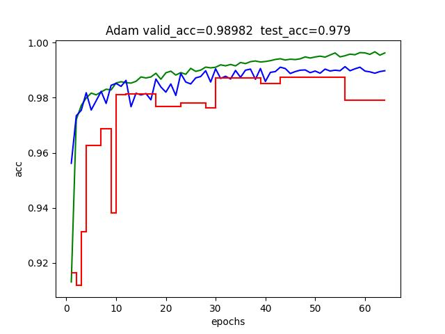

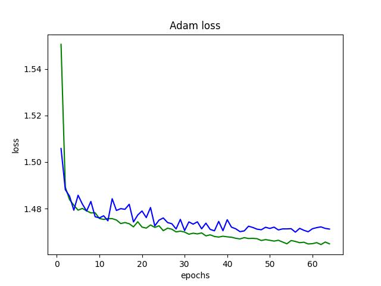

#### Adam+StepLR


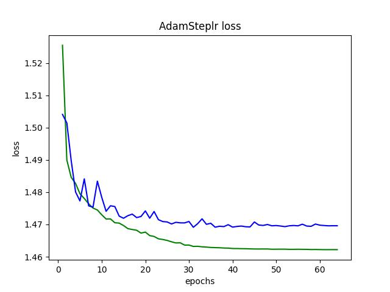

#### Adam+WarmUP

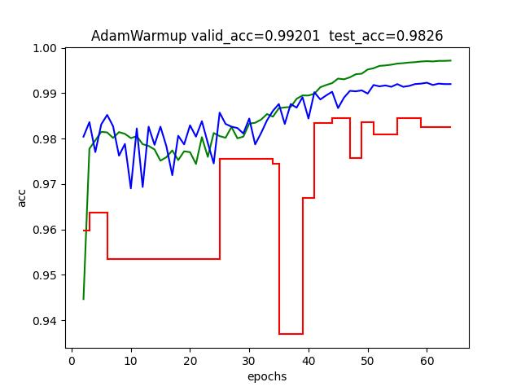

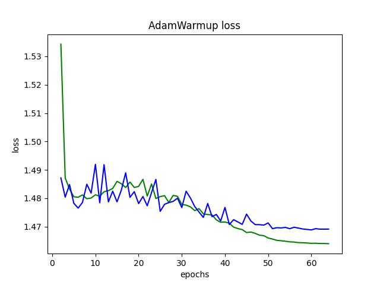

#### NAdam+StepLR

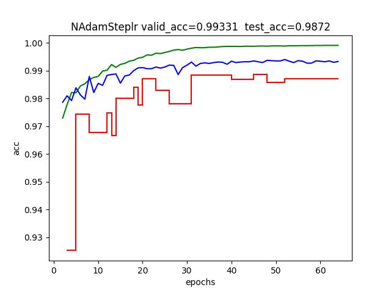

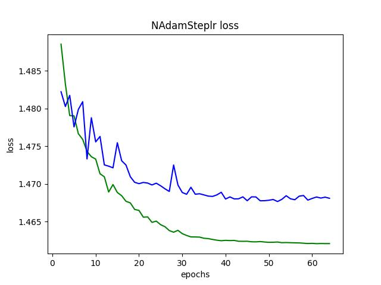

#### SGDM

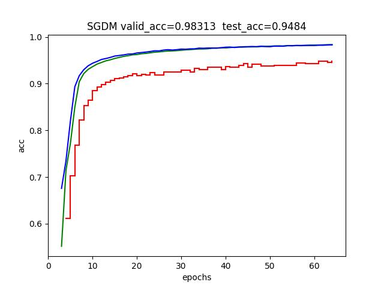

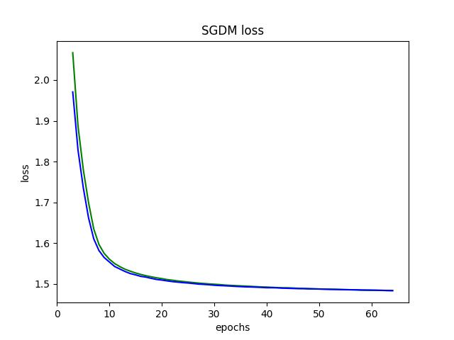

#### SGDM(128epochs)

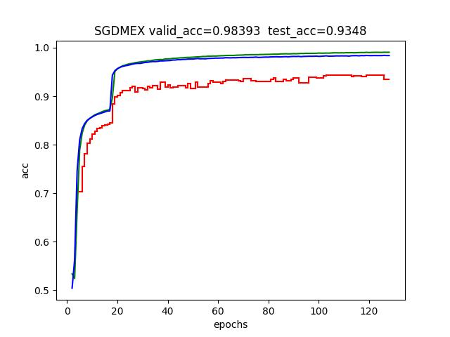

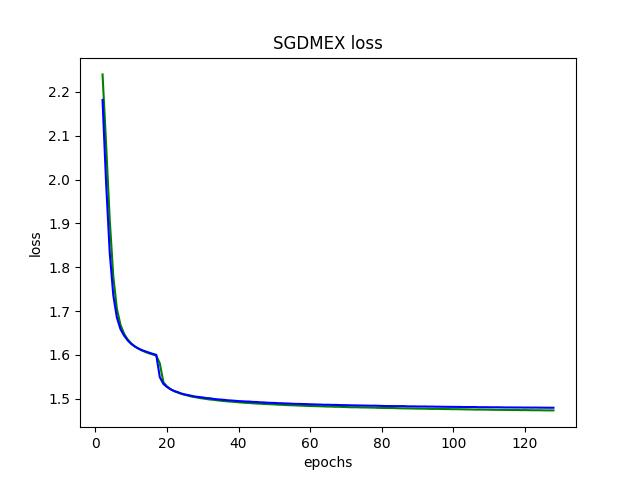

### 实验结果分析分析

#### 恒定学习率 vs StepLR vs Warmup


恒定学习率与WarmUP的测试成绩都收敛在0.98左右，而StepLR则收敛在0.99附近且训练过程较为稳定，因此认为在该任务该模型下StepLR表现更好

#### Adam vs NAdam


NAdam训练前期验证集的loss浮动较大，NAdam的验证准确率更高，但**测试准确率两者差不多**，认定为对于该模型Adam与NAdam在epoch够多的前提下效果差不多

#### SGDM


看似训练集与验证集稳定收敛，但测试集准确率一直上不去!鉴定为在该问题中**不如Adam**

#### 总结

因此最终选择用Adam+StepLR。

共训练64个epoch,初始学习率0.003,每两个epoch变为0.9倍

训练集准确率0.999，验证集准确率0.991，测试集准确率0.989

## 四.实验总结

通过这次实验，我学会了如何构建机器学习的代码，对Dataset、Dataloader、神经网络的搭建有了深刻的体会,深入了解了卷积神经网络的原理与使用方法。我还探究了不同优化方法与学习率计划的训练效果，锻炼了对PyTorch的使用，加深了对机器学习的理解。

## 参考资料

李宏毅2021/2022春机器学习课程 https://www.bilibili.com/video/BV1Wv411h7kN/

李宏毅2023春机器学习课程 https://www.bilibili.com/video/BV1TD4y137mP/

李宏毅春季机器学习课程资料 https://github.com/Fafa-DL/Lhy_Machine_Learning

NewBing

<style>
     img[alt="dnm"]{

     }
     img[alt="def"]{
          width:450px;
     }
     img[alt="sml"]{
          width:360px;
     }
</style>
