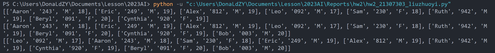
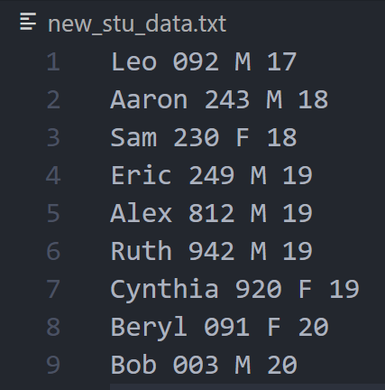

# 人工智能实验报告 第2周

姓名:刘卓逸  学号:21307303

### 一.实验题目

管理student数据实现，实现StuData类

### 二.实验内容

##### 1.算法原理

1.\_\_init__

从文件读入，先将文件分解为行，每个学生的数据占一行;再将行数据分解成数据项，最后将age项从str转换成int

2.AddData

直接list.append(),注意需要把age项转换成int类型

3.SortData

用if-elif对排序关键字进行译码至keys <- 0~3,然后使用list.sort()，其中关键字取item[keys]

```python
self.data.sort(key=lambda item:item[keys])
```

4.ExportFile

file.write()只能输出字符串，依次输出每个学生信息的每个项，强行转换成str类型即可

##### 2.关键代码展示

```python
class StuData:
    def __init__(self,filename:str):
        self.data =[]
        with open(filename,'r') as inputs:
            for student in inputs.readlines():
                self.data.append(student.rstrip().split(' '))
                self.data[-1][-1]=int( self.data[-1][-1])
        #print(self.data)
    
    def AddData(self,name,stu_num,gender,age):
        self.data.append([name,stu_num,gender,int(age)])
        #print(self.data)

    def SortData(self,sortkey):
        if sortkey=='name':
            keys=0
        elif sortkey=='stu_num':
            keys=1
        elif sortkey=='gender':
            keys=2
        else:
            keys=3
        self.data.sort(key=lambda item:item[keys])
        #print(self.data)

    def ExportFile(self,filename:str):
        with open(filename,'w') as outputs:
            for student in self.data:
                for data in student:
                    outputs.write(str(data)+" ")
                outputs.write('\n')
```

##### 3.创新点&优化

从文件读入时，利用list[-1]直接定位到了最近加入的准备操作的这一项

### 三.实验结果及分析

##### 1.实验结果展示示例



正确的执行了读入、添加、排序操作



也正确输出在文档里

### 四.参考资料

从博客参考了list.sort()的使用方法:
https://blog.csdn.net/TCatTime/article/details/82972984

<style>
     img[alt="dnm"]{

     }
     img[alt="def"]{
          width:450px;
     }
     img[alt="small"]{
          width:100px;
     }
</style>
