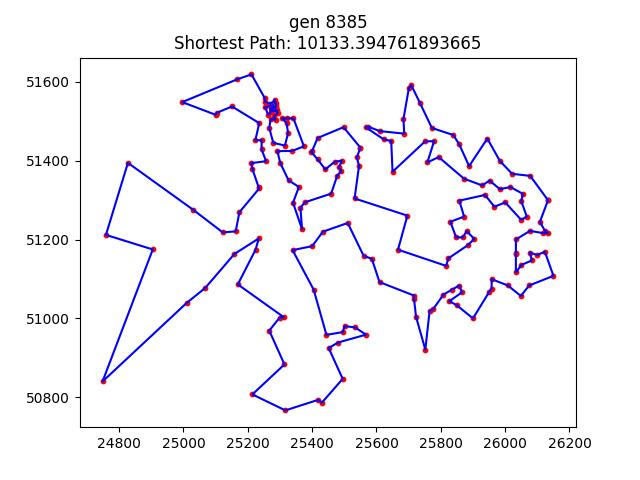

# 人工智能实验报告 第6周

姓名:刘卓逸  学号:21307303

## 一.实验题目

hw5 用遗传算法解决TSP问题

## 二.实验内容

### 1.算法原理

```
建立种群数量为m的种群
进行T次迭代：
    随机挑选m/2对个体进行交配：
        将亲本的部分片段交换，生成两个子代 (交叉)
    对每个个体判断是否变异：
        若变异，则分别生成 部分片段反转 与 部分片段位移 的两个子代(变异)
    对种群按照适应度(按照基因走一遍城市所需距离)排序
    保留前面m个个体，抛弃其余个体(选择)
    若连续p次迭代最优个体仍然没有改变：
        则终止迭代
返回最优个体作为最终结果
```

改进思路

问题1：随着迭代次数的上升，种群的基因多样性会下降，个体之间十分接近
    改进1：为了增加基因多样性，根据遗传算法的仿生特性，引入“物种大灭绝”。物种大灭绝旨在通过种群大面积死亡引入随机基因使得最优个体更有可能改善

问题2：物种大灭绝引入的随机基因相互交配的话作用不大浪费计算时间
    改进2：物种大灭绝一定次数后，选择交配个体时，其中一分指定为最优的三个个体之一

下文会探讨此改进实际的改进效果

```
建立种群数量为m的种群
进行T次迭代：
    若连续d的代最优个体没有改善，则物种大灭绝：
        种群后80%的个体全部死亡，用随机个体补充种群至种群上限
    随机挑选m/2对个体进行交配：
        若连续k次物种大灭绝最优个体没有优化，则亲本之一设为最优的三个个体之一
        将亲本的部分片段交换，生成两个子代 (交叉)
    对每个个体判断是否变异：
        若变异，则分别生成 部分片段反转 与 部分片段位移 的两个子代(变异)
    对种群按照适应度(按照基因走一遍城市所需距离)排序
    保留前面m个个体，抛弃其余个体(选择)
    若连续p次迭代最优个体仍然没有改变：
        则终止迭代
返回最优个体作为最终结果
```

### 2.关键代码展示

##### 类的定义

```
——数据部分——
data_name数据集的名字
city_name各个城市的名字
city_location各个城市的坐标
city_num城市的个数
——超参数——
capacity 种群上限、
extinction 物种大灭绝周期
patience 迭代p次没有改善的话退出迭代
vary_rate 变异率
——模型参数——
gen 已经迭代的次数
population 种群个体信息
    每个个体基因前city_num位表示基因信息，最后一位存放适应度
best 已经找到的最短路长
 ——日志文件-——
log_open 是否记录日志
log_path 日志存放目录
checkpoint  绘制总体优化图时的检查点间隔
loppoint 往日志文件写入记录的周期
drawpoint 生成当前最优路线图的周期
min_log 种群中最差的适应值的日志
max_log 种群中最好的适应值的日志
log_point 存日志时的时间点
```

##### 模型初始化 __init__()

包括读取数据，设置超参数，建立种群，初始化日志 四个部分

一些超参数的选择：

变异率0.5，因为设定的变异不会让变异者消失，所以觉得越大越好，但是会导致每次迭代排序时间边长，设0.5纯属随缘

patience设为city_num的1.4次方，这是通过多次实验得出的较好的参数

```python
	def __init__(self, tsp_filename, logs=False):
        #加载数据
        self.data_name=tsp_filename.split('\\')[-1].split('.')[0]
        ct=0 #找到数据开始的地方
        with open(tsp_filename,'r') as inputs:
            for i in inputs.readlines():
                ct+=1
                if (i.rstrip('\n')=="NODE_COORD_SECTION"):
                    break
        df = pd.read_csv(tsp_filename, sep=" ", skiprows=ct, header=None)
        city = np.array(df[0][0:len(df)-1])
        self.city_name = city.tolist()
        city_x = np.array(df[1][0:len(df)-1])
        city_y = np.array(df[2][0:len(df)-1])
        self.city_location = list(zip(city_x, city_y))
        self.city_num=len(self.city_name)
        #设置超参数
        self.capacity=64
        self.patience=int(pow(self.city_num,1.4))
        self.extinction=20
        self.vary_rate=0.5
        #建立种群
        self.population=[]
        for i in range(self.capacity-len(self.population)):
            self.population.append(self.generate_individual())
            self.population[-1].append(self.fitness(self.population[-1]))
        self.population.sort(key=lambda item:item[self.city_num])
        self.gen=0
        self.best=self.population[0][-1]
        #记录初始信息
        self.log_open=logs
        self.checkpoint=1
        self.drawpoint=10
        self.logpoint=10
        self.log_path='Reports\\hw5\\data\\'
        if self.log_open:
            self.drawmap()
            with open(self.log_path+str(self.data_name)+'_log.txt',"w") as outputs:
                outputs.write(str(0)+' '+str(self.best)+' '+str([i+1 for i in self.population[0][0:self.city_num]])+'\n')
            self.log_point=[0]
            self.min_log=[self.population[-1][-1]]
            self.max_log=[self.population[1][-1]]
        print("ready")
```

##### 适应度计算 fitness()

按照基因走一遍城市所需的路径长度就是适应值（越小越好）

```python
    def fitness(self,idvd): #计算适应值，越低越好
        ans=0
        for i in range(self.city_num):
            ans+=math.sqrt((self.city_location[idvd[i]][0]-self.city_location[idvd[i-1]][0])*(self.city_location[idvd[i]][0]-self.city_location[idvd[i-1]][0])+(self.city_location[idvd[i]][1]-self.city_location[idvd[i-1]][1])*(self.city_location[idvd[i]][1]-self.city_location[idvd[i-1]][1]))
        return ans
```

##### 产生随机个体 generate_individual()

```python
	def generate_individual(self): #生成一个随机的个体
        lst=list(range(0,self.city_num))
        random.shuffle(lst)
        x=random.randint(0,self.city_num)
        return lst[x:self.city_num]+lst[0:x]
```

##### 变异 vary1() 与 vary2()

定义了两种变异方式，片段反转与片段位移

```python
 	def vary1(self,ex): #基因突变(片段反转)
        x=random.randint(0,self.city_num)
        y=random.randint(0,self.city_num)
        if (x>y):
            (x,y)=(y,x)
        return ex[0:x]+list(reversed(ex[x:y]))+ex[y:self.city_num]
    def vary2(self,ex): #基因突变(片段位移)
        x=random.randint(0,self.city_num)
        y=random.randint(0,self.city_num)
        if (x>y):
            (x,y)=(y,x)
        temp=ex[0:x]+ex[y:self.city_num]
        cut=ex[x:y]
        z=random.randint(0,len(temp))
        return temp[0:z]+cut+temp[z:len(temp)]
```

##### 交叉结合 fusion()

两个亲代片段交换产生两个新的子代

```python
	def fusion(self,father,mother): #杂交育种
        x=random.randint(0,self.city_num)
        y=random.randint(0,self.city_num)
        if (x>y):
            (x,y)=(y,x)
        boy=father[0:x]+father[y:self.city_num]
        boyc=mother[x:y]
        girl=mother[0:x]+mother[y:self.city_num]
        girlc=father[x:y]
        for i in range(len(boy)):
            while (boy[i] in boyc):
                boy[i]=girlc[boyc.index(boy[i])]
        for i in range(len(girl)):
            while (girl[i] in girlc):
                girl[i]=boyc[girlc.index(girl[i])]  
        boys=boy[0:x]+boyc+boy[x:]
        girls=girl[0:x]+girlc+girl[x:]
        boys.append(self.fitness(boys))
        girls.append(self.fitness(girls))
        self.population.append(boys)
        self.population.append(girls)
```

##### 种群迭代

```python
	def iterate(self, num_iterations): #迭代
        begin=time.time()
        pc=0
        for _ in range(1,num_iterations):
            pc+=1
            #物种大灭绝
            if pc%self.extinction==0:
                self.population=self.population[0:self.capacity//6]
                for i in range(self.capacity-len(self.population)):
                    self.population.append(self.generate_individual())
                    self.population[-1].append(self.fitness(self.population[-1]))
            #随机两两杂交
            for i in range(len(self.population)//2):
                x=random.randint(0,self.capacity-1)
                if pc>5*self.extinction:
                    x=random.randint(0,min(2,self.capacity-1))
                y=random.randint(0,self.capacity-1)
                if x!=y:
                    self.fusion(self.population[x],self.population[y])
            #突变
            for item in range(len(self.population)): 
                if (random.random()<self.vary_rate):
                    self.population.append(self.vary1(self.population[item]))
                    self.population[-1].append(self.fitness(self.population[-1]))
                    self.population.append(self.vary2(self.population[item]))
                    self.population[-1].append(self.fitness(self.population[-1]))
            #优胜劣汰
            self.population.sort(key=lambda item:item[self.city_num]) 
            self.population=self.population[0:self.capacity]
            self.gen+=1
            #检测优化成功
            if (self.population[0][-1]<self.best):
                self.best=self.population[0][-1]
                pc=0
            if (pc>self.patience):
                break
            #日志记录
            self.updatelog()
        
 		end=time.time()
        if self.log_open:
            self.updatelog(True)
            with open(self.log_path+str(self.data_name)+'_log.txt',"a+") as outputs:
                outputs.write('time cost : '+str(end-begin))
        print("Finishing at",self.gen,"th gen")
        return [self.population[1][-1],[i+1 for i in self.population[0][0:self.city_num]]]
```

##### 日志记录

```python
    def updatelog(self,force=False):
        if not self.log_open:
            return
        if self.gen%self.drawpoint==0 or force:
            self.drawmap()
        if self.gen%self.checkpoint==0 or force:
            self.log_point.append(self.gen)
            self.min_log.append(self.population[-1][-1])
            self.max_log.append(self.population[0][-1])
            self.plot_diagram()
        if self.gen%self.logpoint==0 or force:
            with open(self.log_path+str(self.data_name)+'_log.txt',"a+") as outputs:
                outputs.write(str(self.gen)+': '+str(self.best)+' '+str([i+1 for i in self.population[0][0:self.city_num]])+'\n')
    def drawmap(self): #绘制当前路线
        plt.clf()
        xs=[self.city_location[i][0] for i in self.population[0][0:len(self.population[0])-1]]
        ys=[self.city_location[i][1] for i in self.population[0][0:len(self.population[0])-1]]
        xs.append(xs[0])
        ys.append(ys[0])
        plt.plot(xs,ys,color='b')
        plt.scatter(xs,ys,color='r',s=10)
        plt.title('gen '+str(self.gen)+'\nShortest Path: '+str(self.best))
        plt.savefig(self.log_path+str(self.data_name)+'_gen'+str(self.gen)+'.jpg')
    def plot_diagram(self): #绘制数据迭代表
        plt.clf()
        # for i in range(len(self.log_point)):
        #     if self.max_log[i]!=self.min_log[i]:
        #         plt.plot([self.log_point[i], self.log_point[i]], [self.max_log[i],self.min_log[i]], color='b')
        for i in range(1,len(self.log_point)):
            plt.plot([self.log_point[i-1], self.log_point[i]], [self.max_log[i-1],self.max_log[i]], color='r')
        plt.title('gen '+str(self.gen)+'\nShortest Path: '+str(self.best))
        plt.ylabel('cost')
        plt.xlabel('iteration')
        plt.savefig(self.log_path+str(self.data_name)+'_overall'+'.jpg')
```

### 3.创新点&优化

引入物种大灭绝以及种群之王的机制，增强了对最优数据的扰动使得收敛更快并能找到更好的结果

## 三.实验结果及分析

### 实验结果展示示例

#### 改进前

##### wi29


time cost : 20.547053575515747（包括大量绘图）

##### dj38


time cost : 70.09247541427612（包括大量绘图）

##### qa194




time cost : 333.2304301261902

##### uy734[注：手动中断了]


#### 改进后(加入物种灭绝机制)

##### wi29


time cost : 23.502338409423828（包括大量绘图）

##### dj38


time cost : 44.70436215400696 （包括大量绘图）

##### qa194


time cost : 554.5067965984344

##### uy734


### 评测指标展示及分析

#### 引入“物种大灭绝”的效果

分析以下典型数据：优化前后的代码跑qa194数据某次迭代了五千代的总体优化图：

优化前


优化后


引入物种大灭绝，**收敛速度并无多大区别**，

由于物种大灭绝增大了对最优数据的扰动，使得**最终找到的结果**更好了

**但是**,物种大灭绝时重新构造随机个体时耗费了大量的时间，使得**平均迭代一次的时间慢了很多**

#### 遗传算法的分析

离结果越远，收敛的越快，换言之离结果很近时收敛很慢，如在跑uy734时，从90000优化到88000只迭代了6000代，88000到87000迭代了26000代，从87000迭代到最终结果86917再到迭代结束又要26000代

<style>
     img[alt="dnm"]{

     }
     img[alt="def"]{
          width:450px;
     }
     img[alt="small"]{
          width:100px;
     }
</style>
