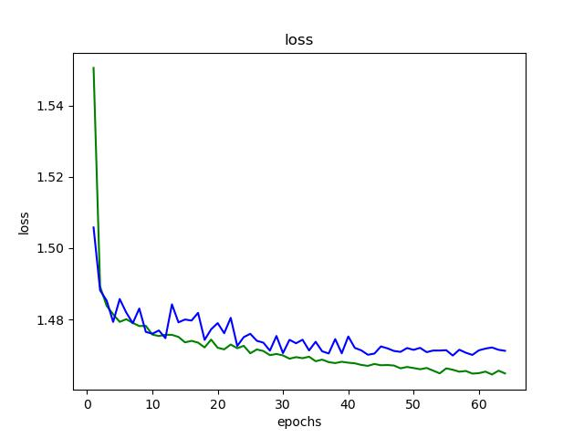
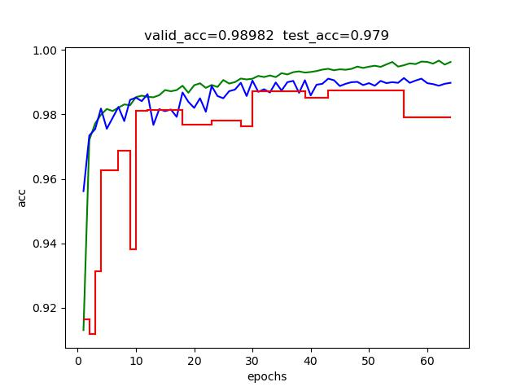

# 人工智能实验报告 第9周

姓名:刘卓逸  学号:21307303

## 一.实验题目

hw7 机器学习：图像分类任务

## 二.实验内容

### 1.实验要求

在MNIST数据集上完成手写数字图片分类任务, 具体要求如下:

+ 示例代码中已经给出从.pth文件加载数据集的代码( Tensor类型), 命名为(train_data, train_labels), (test_data, test_labels), 分别是训练图像, 训练标签, 测试图像和测试标签. 请基于这些Tensor完成训练任务以及测试任务.
+ 用pytorch搭建卷积神经网络(在类中MyConvNet来实现), 在训练集上训练模型, 并在测试集上完成分类测试.
+ 为了方便批改作业, MyConvNet的构造函数请不要使用任何形参.测试时至少用分类正确率来衡量性能(可以添加其他指标来衡量性能并在报告中呈现).
+ 训练结束后, 务必使用torch.save()保存模型(即神经网络的参数等信息). 此次作业需要额外上传模型.模型的文件名格式为hw7_学号_姓名拼音.pth, 例如hw7_21000000_zhangsan.pth.
+ 所有内容在同一个.py代码文件上实现.
+ 作业提交时将.py代码文件和.pth模型文件提交到本科生实验hw7_code文件夹中, 实验报告提交到本科生实验hw7_report文件夹中. 请不要提交其他无关文件.

### 2.算法原理

#### （1）整体框架

```
定义好超参数
创建模型并初始化
将训练数据集拆分成训练集与验证集两部分
对于每个epoch:
    用训练集进行训练：
        将数据输入模型得到预测结果
        计算预测结果与label之间的损失函数
        用反向传播计算梯度
        更新模型参数
    再用验证集求模型准确率:
        将数据输入模型得到预测结果
        计算平均损失函数与准确率
    保存较之前准确率有提升的模型
训练完成，用测试集测量模型实际准确率
```

#### （2）细节

##### 1-神经网络框架

针对图像识分类问题，采用卷积神经网络。

思想是，用不同卷积核扫过整个图形可以提取出图像与卷积核相对应的特征。

如当卷积核为

$$
\begin{bmatrix}
-1 & 0 & 1 \\
-1 & 0 & 1 \\
-1 & 0 & 1
\end{bmatrix} \tag{2}
$$

卷积层输出在左0右1的竖直边缘为正，在左1右0的竖直边缘为负，在连续色块内部以及水平边缘就为0

通过训练卷积核，以得到更好的特征提取效果

##### 2-损失函数

损失函数要用CrossEntropy,**不能用平方误差**。

在二分类问题中(多分类中one-hot向量计算损失时可看作若干个二分类问题)，若采用平方误差，在$f(x)=0$与$f(x)=1$时都会有梯度趋于0，导致离minimal很远的地方的梯度很小，训练就会很慢。

用crossentropy作为损失函数可避免上述问题

##### 3-优化算法

采用Adam。Adam就是将RMSProp与Momentum结合

RMSProp是自适应动态学习率，当梯度小时调大学习率，梯度大时调小学习率。具体学习率如下

Momentum就是“惯性”思想，通过保留上一次的部分梯度，使得在梯度平衡点处也能更新参数，或者借着惯性冲出local minimal

参数$θ_{i}$迭代方式如下

$$
θ^{t+1}_{i} ← θ^{t}_{i} - m^{t}_{i}*{η}/{σ^{t}_{i}}
$$

$m^{t}_{i}$ 来自Momentum思想，具体为 $m^{t}_{i}=βm^{t-1}_{i}+(1-β)g^{t}_{i}$

其中$g^{t}_{i}$是当前的梯度，$β$可以看做为“动量保留率”，$βm^{t-1}_{i}$就是保留的动量

${η}/{σ^{t}_{i}}$ 来自RMSProp, 其中$σ^{t}_{i}= \sqrt{α(σ^{t-1}_{i})^{2}+(1-α)|g^{t}_{i}|^{2}}$

结合考虑之前的梯度与当前梯度的值来动态调整学习率使梯度下降的幅度大致稳定。

### 3.代码展示

#### 准备环境

import PyTorch相关组件

```python
#------ import env ------
import torch
import torch.nn as nn
import torch.optim as optim
from torch.distributions import Categorical
import torch.nn.functional as F
from torch.utils.data import DataLoader, Dataset, random_split

#确保每次调用卷积算法返回确定性输出，即默认算法
torch.backends.cudnn.deterministic = True 
#固定网络结构的模型优化以提高效率，否则会花费时间在选择最合适算法上
torch.backends.cudnn.benchmark = False 
device = torch.device("cuda" if torch.cuda.is_available() else "cpu")
```

#### 封装Dataset与Dataloader

```python
#------ hyper parameter for Data ------
batch_size=16
n_workers=0 #用于数据加载的子进程数 （实验得出越小越好）
```

```python
#------ Dataset ------
class MyDataset(Dataset):
    def __init__(self,datas_dir="",label_dir=""):
        if datas_dir=="":
            return 
        self.datas=torch.load(datas_dir)
        self.label=torch.load(label_dir)

    def __len__(self):
        return self.label.size()[0]
  
    def __getitem__(self,idx):
        return self.datas[idx],self.label[idx]
```

为了保证测试集的泛用性而使模型不一味拟合测试集，测试集将完全不参与训练，以代表最广泛的数据

训练中有train梯度下降与valid选择模型两个环节，考虑将训练集拆分成训练集与验证集两部分

用在验证集中的准确率来选择模型，在测试集中评估模型泛用性

```python
#------ Dataloader ------
def get_dataloader(datas_dir,label_dir,sept=0):
    dataset=MyDataset(datas_dir,label_dir)
    if sept>0:
        #分割成trainset与validset
        validlen=int(sept*len(dataset))
        lengths=[len(dataset)-validlen,validlen]
        trainset,validset=random_split(dataset,lengths)
        train_loader=DataLoader(
            trainset,
            batch_size=batch_size,
            shuffle=True, #训练时将训练数据顺序打乱
            num_workers=n_workers, #用于数据加载的子进程数
            drop_last=True, #最后一个batch可能不满batch_size,抛弃掉
            pin_memory=True, #存在固定内存，加速
        )
        valid_loader=DataLoader(
            validset,
            batch_size=batch_size,
            shuffle=False, #验证时就没必要打乱了
            num_workers=n_workers,
            drop_last=True,
            pin_memory=True,
        )
        return train_loader,valid_loader
    else:
        loader=DataLoader(
            dataset,
            batch_size=batch_size,
            shuffle=True, 
            num_workers=n_workers, 
            drop_last=True,
            pin_memory=True, 
        )
        return loader
```

#### 神经网络框架

先2层卷积层再3层全连接层。

其中一些层的具体用法如下

```python
    torch.nn.Conv2d(in_channels, out_channels, kernel_size, stride, padding)
        # 输入有in_channels层，RGB就有3层，黑白就只有1层
        # 输出是out_channels层
        # 卷积核的边长是kernel_size
        # stride，卷积核每次移动的步长
        # 在图片四周补充padding个像素以保持图片大小
        # 输入为[in_channels,length,width]，那输出为[out_channels,1+(length+2*padding-kernel_size)/stride]

    torch.nn.MaxPool2d(kernel_size, stride, padding)
        # 池化，在每个边长为kernel_size的分区内选一个最大的

    nn.BatchNorm2d(channels)
        # 对各个特征层的值进行归一化，加快训练速度
```

```python
#------ Model ------
class MyConvNet(nn.Module):
    def __init__(self):
        super().__init__()
        #input [1,28,28]
        self.cnn=nn.Sequential(
            nn.Conv2d(1,64,3,1,1), #[64,28,28]
            nn.BatchNorm2d(64),
            nn.ReLU(),
            nn.MaxPool2d(2,2,0), #[64,14,14]
        
            nn.Conv2d(64,128,3,1,1), #[128,14,14]
            nn.BatchNorm2d(128),
            nn.ReLU(),
            nn.MaxPool2d(2,2,0), #[128,7,7]
        )
        self.fc=nn.Sequential(
            nn.Linear(128*7*7,16*7*7),
            nn.ReLU(),
            nn.Linear(16*7*7,2*7*7),
            nn.ReLU(),
            nn.Linear(2*7*7,10)
        )
    def forward(self, x):
        if len(x.size())==3:
            x=x.unsqueeze(0)
        out=self.cnn(x)
        out=out.view(out.size()[0],-1)
        out=self.fc(out)
        return torch.softmax(out,dim=-1)
```

#### 用测试集评估模型真实表现

```python
#------ test ------
def test(data, labels, net):
    num_data = data.shape[0]
    num_correct = 0
    for i in range(num_data):
        feature = data[i]
        prob = net(feature).detach()
        dist = Categorical(prob)
        label = dist.sample().item()
        true_label = labels[i].item()
        if label == true_label:
            num_correct += 1
    return num_correct / num_data
def Testing():
    net= MyConvNet()
    test_data = torch.load('data\\hw7\\test_data.pth')
    test_labels = torch.load('data\\hw7\\test_labels.pth')
    net.load_state_dict(torch.load('hw7_21307303_liuzhuoyi.pth'))
    return test(test_data, test_labels, net)
```

#### 主函数，训练

```python
#------ main ------
if __name__=="__main__":
    from tqdm.auto import tqdm #进度条可视化
    #模型实例化
    model=MyConvNet().to(device)
    #分类问题中,用cross-entropy来定义损失函数,用平方误差会导致离答案很远很近都梯度很小
    criterion = nn.CrossEntropyLoss()
    #Adam 动态学习率(加快收敛速度)+惯性梯度(避免local minimal)
    optimizer = torch.optim.Adam(model.parameters(), lr=0.0003, weight_decay=1e-5)

    if log_open:
        with open(logfile,"w")as op:
            op.write("0 0 0 0 0\n")
        with open(scorefile,"w")as op:
            op.write("0 0\n")

    #dataset/dataloader实例化
    train_loader,valid_loader=get_dataloader(
        datas_dir=train_datafile,
        label_dir=train_labelfile,
        sept=0.167
    )
    best_acc=0

    for epoch in range(n_epochs):
        #----- Training ------
        #开启梯度信息
        model.train() 
        #训练记录
        train_loss=[]
        train_accs=[]

        for batch in tqdm(train_loader):
            #获取数据
            imgs,labels=batch
            #模型预测
            logits=model(imgs.to(device))
            #计算损失函数
            loss=criterion(logits,labels.to(device))
            #梯度清零
            optimizer.zero_grad()
            #反向传播，计算梯度
            loss.backward()
            #梯度裁剪，防止梯度爆炸
            grad_norm = nn.utils.clip_grad_norm_(model.parameters(), max_norm=10)
            #更新参数
            optimizer.step()
            #计算准确率并记录
            acc = (logits.argmax(dim=-1) == labels.to(device)).float().mean()
            train_loss.append(loss.item())
            train_accs.append(acc)

        #求平均损失与准确率
        train_loss = sum(train_loss) / len(train_loss)
        train_acc = sum(train_accs) / len(train_accs)
        print(f"[ Train | {epoch + 1:03d}/{n_epochs:03d} ] loss = {train_loss:.5f}, acc = {train_acc:.5f}")

        # ------ Validation ------
        #关闭梯度信息
        model.eval()
        #验证记录
        valid_loss=[]
        valid_accs=[]

        for batch in tqdm(valid_loader):
            #获取数据
            imgs, labels = batch
            # 验证时不需要计算梯度
            with torch.no_grad():
                logits = model(imgs.to(device))
            #求损失函数
            loss = criterion(logits, labels.to(device))
            #计算准确率并记录
            acc = (logits.argmax(dim=-1) == labels.to(device)).float().mean()
            valid_loss.append(loss.item())
            valid_accs.append(acc)

        #求平均损失与准确率
        valid_loss = sum(valid_loss) / len(valid_loss)
        valid_acc = sum(valid_accs) / len(valid_accs)
        # 更新日志
        print(f"[ Valid | {epoch + 1:03d}/{n_epochs:03d} ] loss = {valid_loss:.5f}, acc = {valid_acc:.5f}" + (" ->best " if (valid_acc>best_acc) else "") )

        if log_open:
            with open(logfile,"a") as op:
                op.write(f"{epoch + 1:03d} {train_loss:.5f} {train_acc:.5f} {valid_loss:.5f} {valid_acc:.5f}\n")
   
        # 保存模型
        if valid_acc > best_acc:
            print(f"Best model found at epoch {epoch}, saving model")
            torch.save(model.state_dict(), modelfile) # only save best to prevent output memory exceed error
            best_acc = valid_acc
            stale = 0

            if log_open:
                with open(scorefile,"a") as op:
                    op.write(f"{epoch + 1:03d} {Testing():.5f}\n")
        else:
            stale += 1
            if stale > patience:
                print(f"No improvment {patience} consecutive epochs, early stopping")
                break

    print("final test acc = ",Testing())
```

### 4.创新点&优化

用Adam优化算法与CrossEntropy损失函数来优化训练过。

采用分割训练集的方式来训练与验证，将测试集留到最后评估使用，加强了评估结果的泛用性。

模块化编写代码，后续好修改成求解其他问题的神经网络训练代码

### 5.可改进点

因为人写字有可能写歪，可以对输入图像作随机的左右旋转或线性变换，实现数据增强。

然而考虑到输入图像只有28*28大小，且读进来就已经是tensor了，故没有做数据增强。

## 三.实验结果及分析

### 训练过程

共训练64个epoch

平均训练速度为 20s/epoch

在训练集上最高准确率为0.987

在验证集上最高准确率为0.991，该模型在测试集上的表现准确率为0.979

```shell
epoch_id  /  train_loss  /  train_acc  /  valid_loss  /  valid_acc
001 1.55056 0.91300 1.50580 0.95617
002 1.48923 0.97206 1.48816 0.97344
003 1.48382 0.97719 1.48532 0.97544
004 1.48144 0.97991 1.47930 0.98183
005 1.47932 0.98169 1.48573 0.97554
006 1.48006 0.98105 1.48196 0.97893
007 1.47904 0.98211 1.47894 0.98233
008 1.47815 0.98311 1.48306 0.97794
009 1.47819 0.98285 1.47651 0.98452
010 1.47576 0.98537 1.47599 0.98522
011 1.47534 0.98583 1.47691 0.98413
012 1.47570 0.98545 1.47475 0.98632
013 1.47568 0.98533 1.48423 0.97674
014 1.47510 0.98597 1.47919 0.98163
015 1.47357 0.98757 1.47998 0.98103
016 1.47399 0.98719 1.47969 0.98153
017 1.47350 0.98757 1.48185 0.97923
018 1.47214 0.98891 1.47427 0.98682
019 1.47435 0.98673 1.47723 0.98393
020 1.47206 0.98907 1.47898 0.98203
021 1.47161 0.98967 1.47614 0.98502
022 1.47296 0.98825 1.48046 0.98083
023 1.47193 0.98915 1.47256 0.98882
024 1.47260 0.98853 1.47505 0.98572
025 1.47051 0.99069 1.47597 0.98502
026 1.47158 0.98959 1.47401 0.98722
027 1.47114 0.99005 1.47349 0.98772
028 1.46999 0.99115 1.47126 0.98982
029 1.47031 0.99087 1.47536 0.98572
030 1.46991 0.99109 1.47056 0.99052
031 1.46899 0.99197 1.47429 0.98702
032 1.46943 0.99161 1.47332 0.98782
033 1.46913 0.99211 1.47431 0.98682
034 1.46955 0.99159 1.47131 0.98992
035 1.46828 0.99282 1.47374 0.98742
036 1.46873 0.99242 1.47107 0.99002
037 1.46803 0.99312 1.47045 0.99042
038 1.46776 0.99338 1.47449 0.98672
039 1.46813 0.99300 1.47051 0.99062
040 1.46787 0.99318 1.47522 0.98592
041 1.46770 0.99348 1.47202 0.98922
042 1.46724 0.99392 1.47132 0.98952
043 1.46698 0.99418 1.47010 0.99111
044 1.46751 0.99372 1.47042 0.99062
045 1.46715 0.99402 1.47243 0.98882
046 1.46721 0.99388 1.47189 0.98952
047 1.46707 0.99416 1.47116 0.99002
048 1.46629 0.99486 1.47091 0.99012
049 1.46667 0.99444 1.47198 0.98912
050 1.46637 0.99484 1.47147 0.98972
051 1.46603 0.99512 1.47203 0.98892
052 1.46639 0.99478 1.47083 0.99042
053 1.46564 0.99554 1.47128 0.98972
054 1.46487 0.99630 1.47128 0.99002
055 1.46628 0.99486 1.47137 0.98982
056 1.46589 0.99528 1.46987 0.99131
057 1.46534 0.99586 1.47151 0.98982
058 1.46555 0.99564 1.47066 0.99052
059 1.46481 0.99642 1.47005 0.99111
060 1.46493 0.99632 1.47134 0.98972
061 1.46537 0.99578 1.47182 0.98942
062 1.46456 0.99672 1.47214 0.98892
063 1.46563 0.99548 1.47149 0.98952
064 1.46486 0.99630 1.47120 0.98982
```

### 训练过程可视化

损失函数(绿线train 蓝线valid)



准确率(绿线train 蓝线valid 红线test)



即使测试准确率可能变差,为了保证评估结果的泛用性，也不以测试准确率来选择模型

### 评测指标展示及分析

测试集完全没有参与训练过程的前提下，对测试集的准确率在0.98上下

该模型在手写数字分类上取得良好且**可靠**的效果

## 四.实验总结

通过这次实验，我学会了如何构建机器学习的代码，对Dataset、Dataloader、神经网络的搭建有了深刻的体会。我深入了解了卷积神经网络的原理与使用方法，也锻炼了对PyTorch的使用。

## 参考资料

李宏毅2021/2022春机器学习课程 https://www.bilibili.com/video/BV1Wv411h7kN/

李宏毅2023春机器学习课程 https://www.bilibili.com/video/BV1TD4y137mP/

李宏毅春季机器学习课程资料 https://github.com/Fafa-DL/Lhy_Machine_Learning

<style>
     img[alt="dnm"]{

     }
     img[alt="def"]{
          width:450px;
     }
     img[alt="small"]{
          width:100px;
     }
</style>
