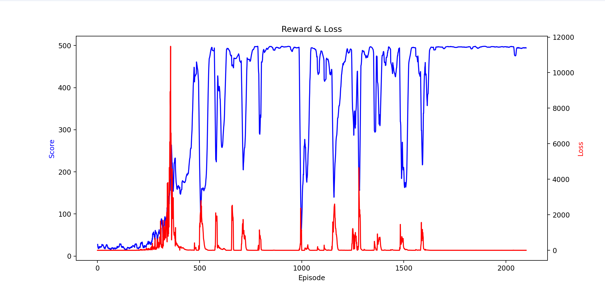

# 人工智能实验报告 第15周

姓名:刘卓逸  学号:21307303

## 一.实验题目

hw10 强化学习: 深度强化学习实践

## 二.实验内容

### 1.实验要求

使用pytorch, 在OpenAI gym的"CartPole-v1"环境实现一种深度强化学习算法(包括但不限于: DQN, Double DQN, Dueling DQN, AC, PPO, SAC等)

环境说明

该环境为小车立杆环境, 状态空间的维度为(4,), 每个维度取值为浮点数, 分别代表小车位置, 速度和杆的角度, 角速度. 动作空间为离散, 取值为0,1, 分别代表小车往左, 往右移动. 奖励值定义为: 小车每坚持一个step则获得奖励+1.

作业要求

+ 1. 将算法实现的代码写到同一个.py代码文件中, 命名格式为形如hw10_21000000_zhangsan.py.
+ 2. 本次作业需额外上传训练好的神经网络模型(与代码文件的神经网络对应), 文件格式为.pth. 若使用多个神经网络, 则可上传多个模型, 其命名需包含hw10+学号+姓名前缀(该前缀与代码文件命名相同).
+ 3. 代码文件中需包含MyAgent类, 其中有类方法get_action(state, eval_mode),以状态state和测试模式eval_mode为输入, 当eval_mode=True时返回整数类型动作a. 还需有类方法load_model(file_name)用于加载模型, 以代码的文件名为输入, 将模型加载到该类中的神经网络. 例如, MyAgent中定义了两个神经网络self.net1=Net1()和self.net2=Net2(), 则load_model方法需要将模型文件hw10_21000000_zhangsan_net1.pth和hw10_21000000_zhangsan_net2.pth加载到网络中. (详见代码加载模型和测试示例)
+ 4. 直接提交代码.py文件和.pth文件到本科生实验hw10_code中, 请不要提交压缩文件和文件夹. 这几个文件和rl_test.py文件放在同一文件夹下时需要保证能够通过run_test()测试.

### 2.算法原理

使用DQN(Deep Q-Learning)算法解决该问题：

```
初始化网络、目标网络
初始化环境和状态s
对于每个episode：
    如果游戏还没结束且没到达最大游戏步数
        根据ε-greedy策略选择一个动作a
        在环境中执行动作，观察转移下一个状态s'，回报r，游戏是否结束done
        将(s,a,r,s',done)加入经验回放池
        从经验回放缓冲区中随机采样一批转移
        对于每一个转移：
            如果到游戏终止状态，则target=r
                否则target=r+γ*Q_target(s')
            计算观测值q=Q(s,a)
            计算损失函数loss = (y - target)^2
            对Q网络进行反向传播
        如果达到更新频率，就从Q网络复制参数到Q_target网络
        将状态更新为下一个状态s = s'
    如果达到终止状态，就结束本episode
```

### 3.实现代码

```python
import torch
import torch.nn.functional as F
import numpy as np
from torch import nn, optim
from torch.optim.lr_scheduler import StepLR
import time
import random
import gym
import matplotlib.pyplot as plt
device = torch.device('cuda:0' if torch.cuda.is_available() else 'cpu')
#----网络----
class QNet(nn.Module):
    def __init__(self, input_size,hidden_size,output_size):
        super().__init__()
        self.nw=nn.Sequential(
            nn.Linear(input_size,hidden_size),
            nn.ReLU(),
            nn.Linear(hidden_size,hidden_size),
            nn.ReLU(),
            nn.Linear(hidden_size,output_size)
        )
    def forward(self, x):
        x=torch.Tensor(np.array(x)).to(device)
        #print(type(x),x.shape)
        return self.nw(x)
#----经验回放池----
class ReplayBuffer:
    def __init__(self,capacity):
        self.buffer=[]
        self.capacity=capacity
    def __len__(self):
        return len(self.buffer)
    def len(self):
        return len(self.buffer)
    def push(self, *transition):
        if len(self.buffer) == self.capacity:
            self.buffer.pop(0)
        self.buffer.append(transition)
    def sample(self,n):
        index = np.random.choice(len(self.buffer), n)
        batch = [self.buffer[i] for i in index]
        return zip(*batch)
    def clean(self):
        self.buffer.clear()
#----超参数----
#网络的输入隐藏输出层维度
input_dim=4
hidden_dim=64
output_dim=2
#经验回放池容量
buffer_capacity=4096
gamma=0.99
#epsilon探索率
eps_max=0.02
eps_decay=0.9999
eps_min=0.01
#训练参数
batch_size=256
episodes=2200
max_step=500
update_target=100
#----Agent-----
class MyAgent:

    def __init__(self):
        self.eval_net=QNet(input_dim,hidden_dim,output_dim).to(device)
        self.target_net=QNet(input_dim,hidden_dim,output_dim).to(device) 
        self.buffer=ReplayBuffer(buffer_capacity)
        self.gamma=gamma

        #损失函数
        self.criterion = nn.MSELoss()
        #Adam 动态学习率(加快收敛速度)+惯性梯度(避免local minimal)
        self.optimizer = optim.Adam(self.eval_net.parameters(), lr=0.0003, weight_decay=1e-5)
  
        self.eps_max=eps_max
        self.eps_decay=eps_decay
        self.eps_min=eps_min
        self.eps=eps_max
        self.learn_step=0
        self.batch_size=batch_size
        self.update_target=update_target

    def get_action(self, state, eval_mode=False):
        if (np.random.uniform()<=self.eps) and (not eval_mode):
            action=np.random.randint(0,2) #随机探索
            #print(action)
            return action
        else:
            action_values = self.eval_net(state).detach().clone().cpu().numpy()
            action=np.argmax(action_values)
            return action
    def store_transition(self, *transition):
        self.buffer.push(*transition)
    def learn(self):
        #更新eps
        self.eps=max(self.eps*self.eps_decay,self.eps_min)
  
        if self.learn_step%self.update_target==0:
            self.target_net.load_state_dict(self.eval_net.state_dict())
        self.learn_step+=1
        states, actions, rewards, next_states, dones = self.buffer.sample(self.batch_size)
  
        actions = torch.LongTensor(actions).to(device)  # LongTensor to use gather latter
        dones = torch.FloatTensor(dones).to(device)
        rewards = torch.FloatTensor(rewards).to(device)
        # 计算评估网络对当前状态和动作的价值估计
        q_eval = self.eval_net(states).gather(1, actions.unsqueeze(1)).squeeze(1)
        # 计算目标网络对下一个状态的最大价值估计，不计算梯度
        q_next = self.target_net(next_states).max(1)[0].detach()
        # 计算目标价值，如果是终止状态，就只有奖励，否则还有折扣后的下一个状态的价值
        q_target = rewards + self.gamma * q_next * (1 - dones)
        loss = self.criterion(q_eval, q_target)
        self.optimizer.zero_grad()
        loss.backward()
        self.optimizer.step()
        return loss

    def load_model(self, file_name):
        self.eval_net.load_state_dict(torch.load(file_name + ".pth", map_location=device))
        self.target_net.load_state_dict(self.eval_net.state_dict())
    def save_model(self, file_name):
        torch.save(self.eval_net.state_dict(),file_name + ".pth")
  

if __name__ == '__main__':
    load_begin=True
    load_name = "hw10_21307303_liuzhuoyi"
    save_name = "hw10_21307303_liuzhuoyi_nxt"
    log_on=True
    log_name = "hw10_21307303_liuzhuoyi_log.txt"
    env = gym.make("CartPole-v1", render_mode="human")
    Rewards=[]
    #exec("from %s import MyAgent"%load_name)
    agent=MyAgent()
    if load_begin:
        agent.load_model(load_name)
    for t in range(episodes):
        state = env.reset(seed=int(time.time()))[0]
        #print(state)
        episode_reward = 0
        loss=0
        done = False
        step_cnt = 0
        while not done and step_cnt < max_step:
            step_cnt += 1 #步数+1
            env.render() 
            action = agent.get_action(state) #算动作
            next_state, reward, done, info, _ = env.step(action) #执行动作
            reward-=abs(next_state[0])/5
            agent.store_transition(state,action,reward,next_state,done) #装载轨迹
            #经验回放池装满了，就开学
            if agent.buffer.len() >= buffer_capacity:
                loss+=agent.learn()
                agent.save_model(save_name)
            #记录训练信息
            episode_reward += reward #回报
            #到下一个状态
            state = next_state
        Rewards.append(episode_reward)
        print(f"Episode: {t}, Reward: {episode_reward}, eps: {agent.eps}, loss: {loss}") 
        if (log_on):
            with open(log_name,'a+')as op:
                op.write(str(episode_reward)+" "+str(agent.eps)+" "+str(loss)+"\n")
```

## 三.实验结果

### 训练过程

实际共训练了2200个episode

用一下代码来绘制log图像:

```python
	import matplotlib.pyplot as plt
import numpy as np
if __name__=="__main__":
    Rewards=[]
    eps=[]
    loss=[]
    with open("hw10_21307303_liuzhuoyi_log.txt","r")as ip:
        for lines in ip.readlines():
            if lines.rstrip()!="":
                line=lines.rstrip().split(' ')
                #print(line)
                Rewards.append(float(line[0]))
                eps.append(float(line[1]))
                if line[2]=='0':
                    loss.append(0.0)
                else:
                    loss.append(float(line[2].split(',')[0][7::]))
    # 计算近10局的均值
    mean_rewards = [np.mean(Rewards[max(0,i-10):i]) for i in range(0, len(Rewards))]

    # 绘制曲线图
    fig,ax1 = plt.subplots()
    color1='b'
    ax1.set_xlabel('Episode')
    ax1.set_ylabel('Score',color=color1)

    color2='r'
    ax2 = ax1.twinx()
    ax2.set_ylabel('Loss',color=color2)
  
    ax2.plot(range(0,len(loss)) ,loss , label="Loss" ,color=color2)
    ax1.plot(range(len(Rewards)), mean_rewards , label="Score" ,color=color1)

    plt.title('Reward & Loss')
    plt.show()
```



### 测试结果

将测试步数提高到了1000以测试模型稳定性

```shell
total reward: 1000.00
```

测试过程中，模型趋向于将小车开到正中间然后小幅度高频抖动维持小车稳定

## 四.实验讨论

#### 实验问题

从训练可视化图可以看出，模型在初步训练到高分后，会随着后续训练有几次分数大幅度下降再回升回高分，**由于没有保存中间过程的模型**，无从得知中间发生了什么。

**猜测**是模型在中途有局部过拟合现象：由于奖励函数设计问题，模型趋向于让小车待在地图中间，太久没探索左右，Q_network过拟合了中心的Q*，造成了state在左右两边时的Q值失真

#### 实验亮点

**奖励函数**除了默认的存活就+1，还引入了坐标的绝对值的负数，使得模型趋向于将小车在地图中间稳定，不会出现左右来回摆或者在地图的某一个边缘抖动的现象

#### 可改进的地方

参考《`Rainbow: Combining Improvements in Deep Reinforcement Learnin`》对dqn进行优化：

双Q-learning、优先权重回放、对决网络、多步学习、分布式RL、引入噪声

## 五.实验总结

通过这次实验，我对dqn及其优化有了初步的了解，对训练方法也有自己的思考，锻炼了自己的编程能力，并实践中实现了DQN

## 六。参考文献

[1] DeepMind Technologies. Playing Atari with Deep Reinforcement Learning. 2013

[2] DeepMind Technologies. Rainbow: Combining Improvements in Deep Reinforcement Learning. 2017

<style>
     img[alt="dnm"]{

     }
     img[alt="def"]{
          width:450px;
     }
     img[alt="sml"]{
          width:360px;
     }
</style>
