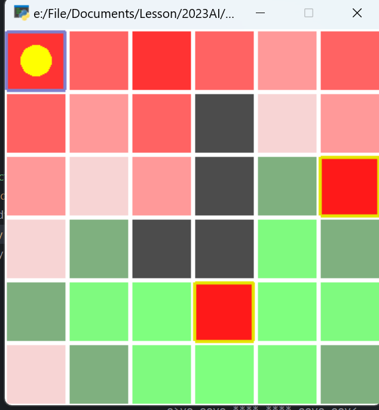

# 人工智能实验报告 第10周

姓名:刘卓逸  学号:21307303

## 一.实验题目

hw8 强化学习：策略迭代与值迭代算法

## 二.实验内容

### 1.实验要求

在网格环境MiniWorld上实现策略迭代或者值迭代算法之一.

该环境由一个 6×6 网格组成，其中黄色圆圈为智能体出发点，黑色格子为无法通过的墙壁，若智能体向着墙壁方向移动，则会停留在原地，地图边界的移动同理。带有黄色边框的格子为终止状态，即若智能体行动至此状态则整个 episode 结束。红色和绿色表示当前该状态的奖励值，奖励越高则绿色越深，奖励越低则红色越深。

状态空间：36（0-35这 36 个整数，左下角为 0，向右 +1，向上 +6）

动作空间：4（0-3这 4 个整数分别代表左、右、上、下）

奖励函数：普通格子 -0.1，到达终点(s=9) +1.0，掉入陷阱(s=23) -1.0。

要求如下：

+ 将所有方法集成到类DPAgent中. 该类的构造函数以强化学习环境env作为输入.
+ 在iteration()方法上实现策略迭代算法或者值迭代算法, 以迭代误差界限threshold参数作为输入(即策略/值误差小于这个值时结束迭代), 返回迭代后的值函数values与策略policy
+ 返回的值函数values与策略policy的数据类型均为numpy数组. values[s]为状态s下的V值, policy[s][a]为状态s下采取动作a的概率.
+ 进行$π(s)←arg\space max_{a} ···$操作时, 如果取值最大的动作不唯一, 则策略修改为等概率采取这些动作. 例如动作1,3均达到最大值, 则policy[s]=[0,0.5,0,0.5]. 若只有唯一的动作1达到最大值, 则policy[s]=[0,1,0,0], 以此类推.

### 2.算法原理

价值迭代：

+ 对每个状态，尝试所有可能的动作，计算采取该动作后到达的下一个状态的期望价值
+ 选择最大的期望价值作为当前状态的价值，更新价值函数
+ 重复上述步骤，直到价值函数收敛
+ 根据最终的价值函数，为每个状态选择最优的动作，得到最优策略

策略迭代：

+ 先进行策略评估：
+ 对每个状态，尝试所有可能的动作，计算采取该动作后到达的下一个状态的期望价值
+ 按照策略函数去分配每个动作的权重算出当前状态的价值，更新价值函数
+ 重复上述步骤，直到价值函数收敛，完成策略评估
+ 然后进行策略优化：
+ 对于每个状态，选择迭代后期望价值最大的动作作为当前状态的唯一动作进行策略更新
+ 如果策略优化步骤没有改动任何策略，则算法完成，否则回到策略评估继续循环

### 3.实现代码

##### 价值迭代

```python
class DPAgent:
    def __init__(self, env):
        self.env = env
        self.n_state = env.observation_space.n
        self.n_action = env.action_space.n

    #由状态state，进行action -> 返回[(next_state,p,reward) ...]
    def go(self,state,action): 
        x, y = env._state_to_xy(state)
        # 运动，并且边缘检测
        if action == 3:
            next_state = (max(x - 1, 0), y)
        elif action == 1:
            next_state = (min(x + 1, env.n_height - 1), y)
        elif action == 2:
            next_state = (x, max(y - 1, 0))
        elif action == 0:
            next_state = (x, min(y + 1, env.n_width - 1))
        else:
            raise ValueError('Invalid action')
        # 障碍检测
        if next_state in env.blocks:
            next_state = (x,y)
        nx=env._xy_to_state(next_state)
        reward=env.R[nx]
        return [(nx,1,reward)] #在本题中往一个方向行动100%有下个状态
    
    def iteration(self, threshold=1e-3):
        gamma=0.9
        values = np.zeros([self.n_state])
        policy = np.zeros([self.n_state, self.n_action])
        
        # 价值迭代
        count=0 #计数器
        maxc=self.n_state**2 #最大迭代次数
        while True:
            count+=1
            delta = 0
            values_new = np.zeros([self.n_state])

            for s in range(self.n_state):
                if (env._state_to_xy(s) in env.blocks or env._state_to_xy(s) in env.ends):
                    continue
                # [self.go(s,a) for a in range(self.n_action)]一个 [行动，行动可能的下一个状态] * (概率、下一个状态、行动期望回报)
                # nx 某个行动对应的所有可能的下一个状态
                q_values=[ sum([ p*(reward+ gamma*values[next_state]) for (next_state,p,reward) in nx ]) for nx in [self.go(s,a) for a in range(self.n_action)] ] 
                values_new[s]=max(q_values)
                delta = max(delta, abs(values[s]-values_new[s])) #最大的迭代变化
            values=values_new #迭代完后更新总体
            if (delta<threshold or count>=maxc):
                break
        # 生成最优策略
        for s in range(self.n_state):
            if (env._state_to_xy(s) in env.blocks or env._state_to_xy(s) in env.ends):
                continue
            q_values=[ sum([ p*(reward+ gamma*values[next_state]) for (next_state,p,reward) in nx ]) for nx in [self.go(s,a) for a in range(self.n_action)] ]
            
            maxq=max(q_values)
            t=1/sum([q_values[i]==maxq for i in range(self.n_action)]) #有多少个多少个取值最大的动作
            for i in range(self.n_action):
                if (q_values[i]==maxq):
                    policy[s][i]=t;
            #policy[s][np.argmax(q_values)]=1;
        return values, policy

```

##### 策略迭代
 
```python
class DPAgent:
    def __init__(self, env):
        self.env = env
        self.n_state = env.observation_space.n
        self.n_action = env.action_space.n

    #由状态state，进行action -> 返回[(next_state,p,reward) ...]
    def go(self,state,action): 
        x, y = env._state_to_xy(state)
        # 运动，并且边缘检测
        if action == 3:
            next_state = (max(x - 1, 0), y)
        elif action == 1:
            next_state = (min(x + 1, env.n_height - 1), y)
        elif action == 2:
            next_state = (x, max(y - 1, 0))
        elif action == 0:
            next_state = (x, min(y + 1, env.n_width - 1))
        else:
            raise ValueError('Invalid action')
        # 障碍检测
        if next_state in env.blocks:
            next_state = (x,y)
        nx=env._xy_to_state(next_state)
        reward=env.R[nx]
        return [(nx,1,reward)] #在本题中往一个方向行动100%有下个状态
    
    def iteration(self, threshold=1e-3):
        gamma=0.9
        values = np.zeros([self.n_state])
        policy = np.full([self.n_state, self.n_action],[0.25,0.25,0.25,0.25])
        count=0
        while True:
            count+=1
            # print(count)
            # env.show_policy(policy)  # 在终端打印每个状态下的动作
            #策略评估
            while True:
                delta = 0
                values_new = np.zeros([self.n_state])
                for s in range(self.n_state):
                    if (env._state_to_xy(s) in env.blocks or env._state_to_xy(s) in env.ends):
                       continue
                    q_values=[ sum([ p*(reward+ gamma*values[next_state]) for (next_state,p,reward) in nx ]) for nx in [self.go(s,a) for a in range(self.n_action)] ] 
                    for i in range(self.n_action):
                        values_new[s]+=policy[s][i]*q_values[i]
                    delta = max(delta, abs(values[s]-values_new[s])) #最大的迭代变化
                values=values_new #迭代完后更新总体
                if (delta<threshold):
                    break

            #策略优化
            policy_stable=True
            policy_new=np.zeros([self.n_state, self.n_action])
            for s in range(self.n_state):
                if (env._state_to_xy(s) in env.blocks or env._state_to_xy(s) in env.ends):
                    continue
                q_values=[ sum([ p*(reward+ gamma*values[next_state]) for (next_state,p,reward) in nx ]) for nx in [self.go(s,a) for a in range(self.n_action)] ] 
                maxq=max(q_values)
                t=1/sum([q_values[i]==maxq for i in range(self.n_action)]) #有多少个多少个取值最大的动作
                for i in range(self.n_action):
                    if (q_values[i]>=maxq):
                        policy_new[s][i]=t;
                if (sum([policy_new[s][i]!=policy[s][i] for i in range(self.n_action)])>0):
                    policy[s]=policy_new[s]
                    policy_stable=False
            if policy_stable:
                break
        return values, policy
```

## 三.实验结果

### 结果展示

##### 价值迭代


```
SSSS oovo o>v< o>oo oovo oov< 
o>vo oovo oov< **** oovo ooo< 
o>vo oovo ooo< **** oovo EEEE 
o>vo oovo **** **** oovo oov< 
o>oo o>oo o>oo EEEE ooo< ooo< 
^>oo ^>oo ^>oo ^ooo ^oo< ^oo< 
```

##### 策略迭代


```
SSSS oovo o>v< o>oo oovo oov< 
o>vo oovo oov< **** oovo ooo<
o>vo oovo ooo< **** oovo EEEE
o>vo oovo **** **** oovo oov<
o>oo o>oo o>oo EEEE ooo< ooo<
^>oo ^>oo ^>oo ^ooo ^oo< ^oo<
```

### 具体分析

##### 价值迭代过程




有点像搜索那样蔓延

##### 策略迭代过程

```
SSSS ^>v< ^>v< ^>v< ^>v< ^>v<
^>v< ^>v< ^>v< **** ^>v< ^>v<
^>v< ^>v< ^>v< **** ^>v< EEEE
^>v< ^>v< **** **** ^>v< ^>v<
^>v< ^>v< ^>v< EEEE ^>v< ^>v<
^>v< ^>v< ^>v< ^>v< ^>v< ^>v<
```


```
SSSS oovo oovo ooo< oovo ooo<
oovo oovo oovo **** oovo ooo<
oovo oovo ooo< **** oovo EEEE
oovo oovo **** **** oovo oovo
o>oo o>oo o>oo EEEE ooo< ooo<
o>oo o>oo o>oo ^ooo ooo< ooo<
```


```
SSSS oovo oov< o>oo oovo oov<
o>vo oovo oov< **** oovo ooo<
o>vo oovo ooo< **** oovo EEEE
o>vo oovo **** **** oovo oov<
o>oo o>oo o>oo EEEE ooo< ooo<
^>oo ^>oo ^>oo ^ooo ^oo< ^oo<
```


```
SSSS oovo o>v< o>oo oovo oov<
o>vo oovo oov< **** oovo ooo<
o>vo oovo ooo< **** oovo EEEE
o>vo oovo **** **** oovo oov<
o>oo o>oo o>oo EEEE ooo< ooo<
^>oo ^>oo ^>oo ^ooo ^oo< ^oo<
```


```
SSSS oovo o>v< o>oo oovo oov< 
o>vo oovo oov< **** oovo ooo<
o>vo oovo ooo< **** oovo EEEE
o>vo oovo **** **** oovo oov<
o>oo o>oo o>oo EEEE ooo< ooo<
^>oo ^>oo ^>oo ^ooo ^oo< ^oo<
```

有点像摆正方向?

## 四.实验总结

按照实验要求实现了简单的价值迭代与策略迭代的程序，对强化学习有了基础的了解与思考

<style>
     img[alt="dnm"]{

     }
     img[alt="def"]{
          width:450px;
     }
     img[alt="sml"]{
          width:360px;
     }
</style>
